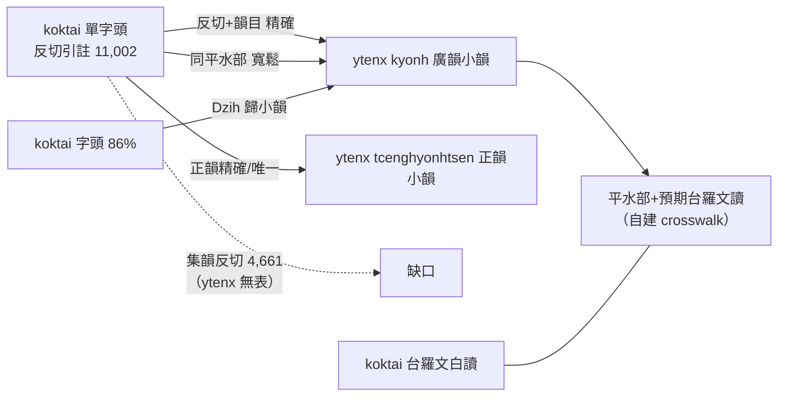

# 與韻典網（ytenx）聲韻查表的對應分析

分析對象：`~/dev/ytenx`（韻典網 Django 專案）之 `ytenx/sync/` 開放資料。
結論先行：**koktai 與 ytenx 零程式碼耦合；對應為資料層 join**，本文件記錄查表盤點、
join 實驗方法與量測結果，為 `build_unified_index.py` 的設計依據。

## 1. ytenx 查表盤點（`ytenx/sync/`）

| App | 韻書 | 主要檔案 |
|---|---|---|
| `kyonh` | **廣韻** | `SieuxYonh.txt` 3,874 小韻（序 代表字 聲母 韻母 韻目 反切 頁）；`Dzih.txt` 25,334 字條（字 小韻序 位次 釋義；**首欄是字**）；`CjengMux.txt` 39 聲母（含聲類）；`YonhMux.txt` 韻母（韻系/等/開合/舒促/舒入對立）；`YonhMiuk.txt` 206 韻目（含 A/B 重紐尾；調 1–4）；`YonhGheh`、`YonhMiukDzip`、`KuangxYonhMiukTshiih`、`PrengQim.txt`（古韻羅馬字/有女羅馬字/白一平/**推導中州音/推導普通話**）、`NgixQim`（高本漢…蒲立本 11 家擬音）、`DrakDzuonDang`（澤存堂本頁碼） |
| `tcenghyonhtsen` | **洪武正韻牋** | `SieuxYonh.txt` 2,294 小韻（帶欄名列：韻目 反切上/下字 聲母 韻母 IPA **訓民正音譯訓**） |
| `pyonh` | **《分韻撮要》**（粵語）— **不是平水韻** | 33 韻部：先威幾諸修東英賓張剛朝孤鴛皆登師金交栽兼津雖科緘翻家官魁遮干甘彭吾；無反切 |
| `trngyan` | 中原音韻 | `TriungNgyanQimYonh.txt` 等 |
| `dciangx` | 上古音系 | `DrienghTriang.txt`（鄭張尚芳） |
| `jihthex` | 字統 | `JihThex.csv` |

字形要點：ytenx 韻目用 **眞、晧、号、寑、豔、釅**（koktai 引文用 真、皓、號、寢、艷、驗）。

## 2. koktai 側的聲韻對應面

1. **中古反切引註**（主 join 面）：單字頭「X切，Y韻(來源)」全語料 11,002 筆。
   舊 jade 文本層幾乎沒有（~374 筆散引）——引註存在於 .dic 源檔，v1 管線丟棄。
2. **字頭層**：卷 1 實驗 420 字頭有 **86.2%（362）** 見於廣韻 `Dzih.txt`
   （缺席者為晚起俗字：啵搬闆甭泵…）→ 字級 fallback 比反切字串 join 穩健。
3. **現代聲韻表**：koktai 方音符號/台羅（台語共時層）vs ytenx 拼音/擬音（中古構擬層）
   ——無共用鍵，是**互補**：ytenx 有「推導中州音/推導普通話」而無推導台語；
   koktai 的文白讀音正是缺的那欄。經 join 後可產出「中古地位 ↔ 台語文白讀」。

## 3. 卷一對照實驗（方法與數據）

方法：抽出 `01.dic.utf8.txt` 全部 638 筆「X切，Y韻」→ 與兩表以（反切二字＋韻目）
精確比對；先做字形正規化（真→眞、皓→晧、號→号、寢→寑、艷→豔、驗→釅、痲→麻）
與調前綴剝除（「入屋韻」→屋）。

| 結果桶 | 筆數 | 佔比 |
|---|---|---|
| 廣韻精確 | 121 | 19.0% |
| 正韻精確 | 111 | 17.4% |
| 兩表皆中 | 48 | 7.5% |
| **可精確 join** | **280** | **43.9%** |
| 反切在表、韻目不合 | 117 | 18.3% |
| 完全無命中 | 241 | 37.8% |

輔助量測：638 筆中相異反切 234 個——見於廣韻 28%、正韻 36%、任一 52%。

### 韻目命名體系鑑定

引文韻目 129 型：69 型只存在於廣韻 206 目體系（鐸至肴覺潸沒職宵黠混宕線講旨祭…，
270 tokens）；「僅正韻」3 型與「兩邊皆無」9 型全數為**異體字假象**
（真/眞、皓/晧、號/号、寢/寑、艷/豔＋集韻式「驗」= 廣韻「釅」）。
→ **韻目命名 = 切韻系 206 目**（非正韻 76 目）。

### 「韻目不合」桶的系統性

樣本：蒲八切「黠」vs 表「鎋」、滂禾切「歌」vs「戈」、蒲北切「職」vs「德」、
博厄切「陌」vs「麥」、薄邁切「卦」vs「夬」——全是**平水韻併部**
（黠=黠鎋、歌=歌戈、職=職德、陌=陌麥昔、卦=卦怪夬）。
辭典以平水目稱鄰韻。ytenx **沒有**平水表（pyonh 是分韻撮要），
故 crosswalk 自建（`data/kuangx_pingshui.json`），
在索引中以「廣韻反切·平水寬」方法收回此桶。

### 無命中桶的來源判定

無命中反切形態（薄沒切、逋禾切、皮駕切、部可切、布拔切…）為典型**集韻**讀法
［推斷：依反切用字風格與康熙字典轉引體例，未逐條核集韻原書］。
koktai 引註來源標記統計（卷 1）：未標 590、康典 19、唐韻 12、廣韻 7、集韻 7、正韻 3
——吳守禮多經康熙字典轉引諸韻書（廣/唐/集/韻會/正），未標者即混合來源。
**ytenx 全站無集韻表** → 此桶在 ytenx 資料域內無解；補集韻資料集是唯一解法。

## 4. 全語料 join 成果（索引實測）

見 [unified-index.md](unified-index.md)：精確 6,341/11,002（57.6%），
字頭 fallback 再覆蓋 3,414 字。方法優先序與寬鬆規則之語言學根據即本文件第 3 節。

## 5. 對應總結

